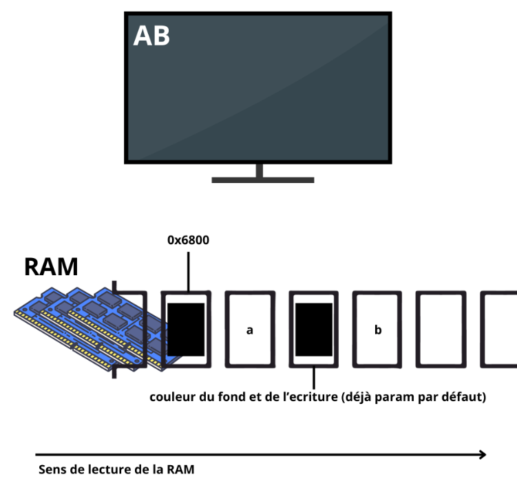
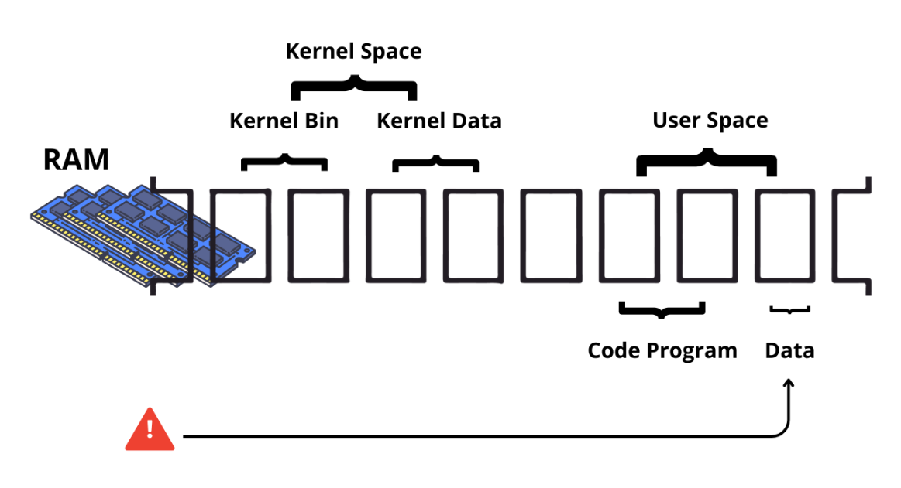

# Faire son propre OS - Prototype

> Ce projet est une implémentation d’un système d’exploitation minimaliste en C++, basé en grande partie sur les vidéos de la chaîne YouTube [Write Your Own Operating System](https://www.youtube.com/@writeyourownoperatingsystem).  
> 📄 Le PDF fourni avec ce projet contient des informations essentielles extraites des vidéos.

---

## Ressources utiles

- [OSDev Wiki](https://wiki.osdev.org/)
- [Lowlevel.eu](https://wiki.osdev.org/Low_Level_Programming)

---

## Dépendances

Assurez-vous d’installer les paquets suivants :

```bash
sudo apt-get install g++ binutils libc6-dev-i386 xorriso
```

---

## processus de démarrage


1. Au démarrage, la carte mère va copier les données du BIOS (assembleur) dans la RAM, que l'on appelle le firmware
(microcode, microprogramme). Il indique au CPU de pointer le registre IP (Instruction Pointer), ce qui permet au CPU de
lire et exécuter les informations contenues dans la RAM. 
2. Le firmware indique au CPU de lire le contenu du disque dur, qui sera chargé dans la RAM (boot loader). Ensuite, l'adresse
du registre IP passe à celle du boot loader en RAM pour exécuter ce dernier. 
3. Le bootloader, complexe, gère les systèmes de fichiers ainsi que les partitions. Cela permet d'accéder au chemin
`/boot/grub/grub.cfg` , qui contient le menu des entrées menant aux OS (en gros il permet de situer dans le DD les OS) (c’est
la partie qui affiche les OS accessible lors du démarrage)
4. Une fois choisie, le bootloader effectue une copie du noyau (ici kernelbin) dans la RAM et fait pointer le registre IP vers
cette copie, ce qui permet à l'ordinateur de charger le système d'exploitation.

Une fois qu’on a compris ça, il reste encore d’autres problèmes pour mettre en place ces actions.

---

### **Probleme 1 :**
>Le boot loader n’initialise pas le registre ESP (Stack Pointer). Qui est nécessaire pour CPP pour fonctionner correctement.
- créer deux fichiers, `loader.s` en assembleur pour definir ESP, et sauter vers le deuxieme fichier CPP `kernel.cpp` qui
contient l’OS
- `loader.s` est compilé par GNU AS et donne `loader.o` , `kernel.cpp` qui contient l’OS.
est compilé par g++ et donne `kernel.o` 

### **Probleme 2 :**
>Les deux objets codés dans les langages différents doivent être combiné.
- utilisation du programme LD. qui est un “linker” et donne un fichier kernel bin
- *Le CPU par défaut est compatible 32 bit (au démarrage), donc nous allons faire un noyau en 32 bit.*

### **Probleme 3 :**
>le stack pointeur (négatif) peut pointer vers des emplacement mémoire de la RAM déjà utilisé et overwrite des informations 
- allouer de la place afin de ne pas écrire (2mb suffisent)

### **Probleme 4 :**
>Le boot loader ne va pas reconnaitre ce que l’on a fait comme un kernel, car il ne contient pas de metric number.
- Il est à l'emplacement mémoire : `0x1badb002`
contient l’OS
- La size de la RAM, le bootloader crée une structure et store a pointer vers cette structure dans le registre AX, et le metric number dans le registre BX

### **Probleme 5 :**
Comme nous utilisons en CPP en dehors d'un OS existant. Les imports n'existent pas, ainsi :
```c++ 
#include <stdio.h>;
```
*les bibliothèques ne sont pas contenues dans notre OS.*
> Pas de dynamic linking, pas de memory management, pas de malloc etc…
- **Solution** : do it yourself :)
*nous devons donc écrire notre propre printf par exemple*
- *cpdt le code qui définit ces fonctions est souvent open source donc..*


## Affichage texte



Ecrire à l’emplacement `0xb8000` sera affiché par la carte graphique. Qui est séparé en deux dans l'emplacement mémoire. Qui est lu dans l'ordre suivant. Couleur et fond de l'écriture puis `char`. 

*par défaut: couleur du fond = noir, police = blanche. Comme quand on ouvre un invité de commandes*

---

##  Ajouter l’OS à GRUB (multiboot)

Au moment où j’écris ce texte. Il faut avoir grub sur son ordinateur, et je ne sais pas si je vais m'occuper d'un multiboot, car ma VM kali le contient déjà et est simple à mettre en place.

```bash
make …
sudo vim /boot/grub/grub.cfg
```

```bash
### BEGIN MYKERNEL ###

menuentry 'Le nom de votre OS qui s affichera lors du démarrage.'{
	multiboot /boot/mykernel.bin
	boot
}

### END MYKERNEL ###
``` 
Pour quitter => *:w!* *:q*

## 🧪 Exécution sous VirtualBox

Créer une VM :
- Type : `Other`
- Version : `Other/Unknown`
- Ajouter l’ISO générée

*NB: la commande make run permet de lancer la VM*

---

## Communication avec le materiel

*La communication avec le hardware doit être précise*
- nous devons savoir précisément sur combien de bit la data est codé, et où elle se situe.
- Dans l’un de nos fichier. nous avions déclaré un `unsigned int` en 4 bit, dans notre programme il faut le déclarer de telle sorte.
    - C’est le rôle du fichier `types.h` qui définie ces types. que nous utiliserons tout le temps par la suite.

---

## Segments mémoire



/!\ Une attaque qui existait, était de charger du code binaire dans la partie de mémoire réservé a la data. Que l’on appelle **Data Segment** *Aujourd’hui il n’est plus possible de pouvoir jump dans cette partie aussi facilement*, la partie qui contient le code binaire “Code program” est appelé **Code Segment** 

---

##  Gestion du clavier

Lorsque l’on clique sur une touche du clavier. Le voltage traverse le câble et le processeur lit cette information.
- Cela peut mener a une interruption qui permet de faire sauter l’ordinateur à une adresse mémoire différente.
    - Il faut ainsi réaliser un `Interrupt descriptor table` qui contient les informations pour switch ou non la mémoire segment.
    - Afin de gérer les segments, nous devons réaliser une `Global Descriptor Table` (GDT)

##  GDT, ou Global Descriptor Table

La table globale de description est une table qui contient les informations suivantes :
- Point de départ du segment
- Taille du segment
- Des flags tq: s’il s’agit d’un Code Segment ou non, si le fichier est un exécutable ou non, quels droits à besoin le fichier
pour faire un saut à son adresse..

Elle est codé sous **8 Octets** (Bytes) et la difficulté repose sur la manière dont ces 8 octets sont écris. En effet le GDT doit être retrocompatible (backward compatible). c’est à dire qu’il doit fonctionner avec des versions antérieurs tq les **processeurs 386** avec des adresses de **16 bits**, ce qui donne une écriture des bits très compliqué.

Cela donne une représentation de la sorte :

| <span style="color: tomato;">pointer</span> | <span style="color: dodgerblue;">limite</span> (4bit) / flag (4bit) | <span style="color: orange;">Droits d’accès</span> | <span style="color: tomato;">pointer</span> | <span style="color: tomato;">pointer</span> | <span style="color: tomato;">pointer</span> | <span style="color: dodgerblue;">limite</span> | <span style="color: dodgerblue;">limite</span> |
|:-:|:-:|:-:|:-:|:-:|:-:|:-:|:-:|
| <span style="color: tomato;">0000 0000</span> | <span style="color: dodgerblue;">0000</span> <span>0000</span> | <span style="color: orange;">0000 0000</span> | <span style="color: tomato;">0000 0000</span> | <span style="color: tomato;">0000 0000</span> | <span style="color: tomato;">0000 0000</span> | <span style="color: dodgerblue;">0000 0000</span> | <span style="color: dodgerblue;">0000 0000</span> |


on a donc des informations entre les bits qui ne sont pas succincts. qui rend l’opération plus lourde et complexe. en effet pour lire les informations du pointeur. il faut lire toutes les informations en rouge. et donc sauter les bits intermédiaires. Une opération à coder à la main.

---

##  Problèmes spécifiques à C++

- Les constructeurs des objets globaux ne sont pas appelés automatiquement.
- Pas de support pour `static`, `class`, `composite structures`, etc.

➡️ Solution : utiliser des types primitifs et pointeurs autant que possible.

---

## Crédits

Basé sur la chaîne [Write Your Own Operating System](https://www.youtube.com/@writeyourownoperatingsystem).  
Merci à l’auteur original pour la documentation vidéo très complète.
